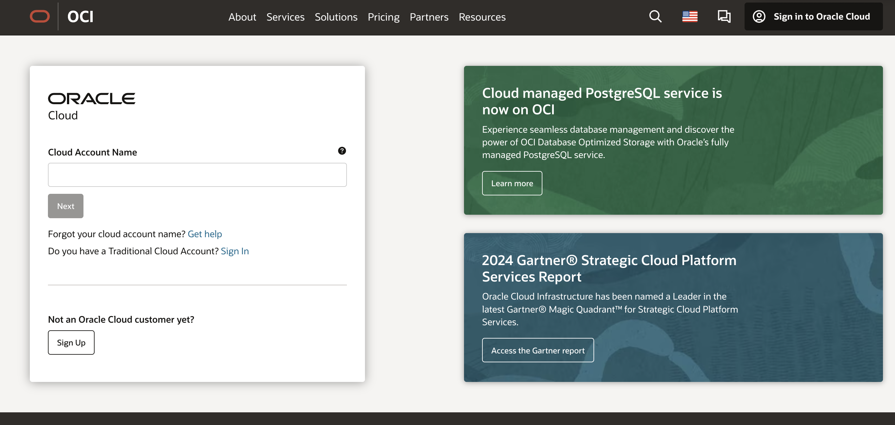
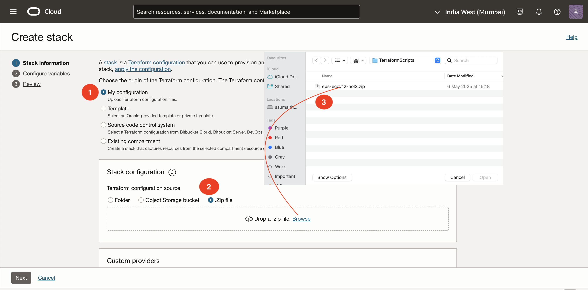
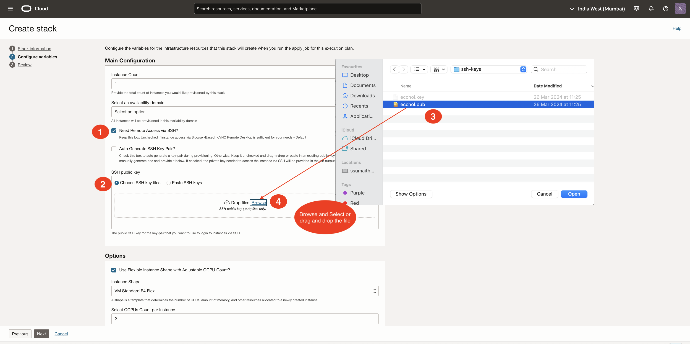
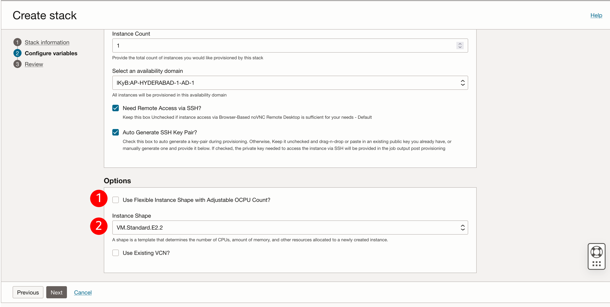
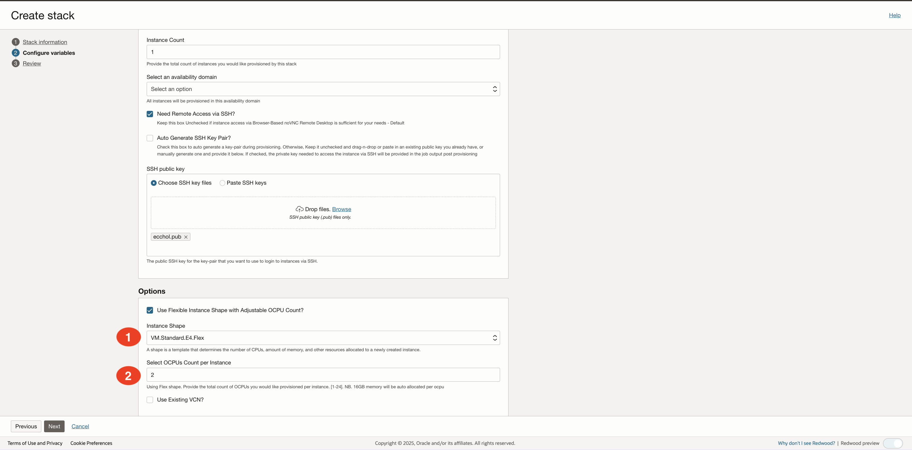

# Prepare and Set up compute instance (Optional)


## Introduction

This lab is optional and is only required if you want to run this workshop on your own tenancy. If you are running this workshop on LiveLabs sandbox then please skip this lab. 

This Lab will show you how to download the Oracle Resource Manager (ORM) stack zip file needed to setup the resource needed to run this workshop and will show you how to set up a Resource Manager stack that will generate the Oracle Cloud objects needed to run your workshop. 

*Estimated Lab Time:* 25 minutes

### Objectives
-   Download ORM stack
-   Create Compute + Networking using Resource Manager Stack
-   Connect to compute instance


### Prerequisites
This lab assumes you have:
- An Oracle Free Tier or Paid Cloud account
- SSH Keys
## Task 1: Download Oracle Resource Manager (ORM) stack zip file
1.  Click on the link below to download the Resource Manager zip file you need to build your environment: [ebs-eccv10-mkplc.zip](https://raw.githubusercontent.com/ecchol/Oracle/my-new-branch/ebs-eccv10-mkplc.zip)

2.  Save in your downloads folder.

We strongly recommend using this stack to create a self-contained/dedicated VCN with your instance(s). Skip to *Task 3* to follow our recommendations. If you would rather use an exiting VCN then proceed to the next step as indicated below to update your existing VCN with the required Egress rules.

## Task 2: Setup Compute   
Open [OCI console](https://www.oracle.com/cloud/sign-in.html?redirect_uri=https%3A%2F%2Fcloud.oracle.com%2F)  and login with your account credentials.
  

Using the details from the two steps above, proceed to the lab *Environment Setup* to setup your workshop environment using Oracle Resource Manager (ORM) and one of the following options:
-  Create Stack:  *Compute + Networking*


## Task 3: Create Stack: Choose a Path 
Watch the video below for a walk-through of the Environment Setup lab.
[Lab walk-through](videohub:1_icfgp61i)

### About Terraform and Oracle Cloud Resource Manager
For more information about Terraform and Resource Manager, please see the appendix below.
Proceed to deploy your workshop environment using Oracle Resource Manager (ORM) stack

Your options are:
1. Task 3A: Create Stack:  **Compute + Networking** *(recommended)*
2. Task 3B: Create Stack:  **Compute Only**

## Task 3A: Create Stack:  Compute + Networking
1. Identify the ORM stack zip file downloaded in *Lab: Prepare Setup*
2. Log in to Oracle Cloud
3.  Open up the hamburger menu in the top left corner.  Click **Developer Services**, and choose **Resource Manager > Stacks**. Choose the compartment in which you would like to install the stack. Click **Create Stack**.

  

  

4.  Select **My Configuration**, choose the **.Zip file** button, click the **Browse** link, and select the zip file that you downloaded or drag-n-drop for the file explorer.

  

5.  Click **Next**.

6. Enter or select the following:

  

    - **Instance Count:** Accept the default, **1**, unless you intend to create more than one (e.g. for a team)
    - **Select Availability Domain:** Select an availability domain from the dropdown list.
    - **Need Remote Access via SSH?** In this step you have 3 options to select from:
        - **Option (A)** - Keep Unchecked for Remote Desktop only Access - The Default
        - **Option (B)** - Check *Need Remote Access via SSH?* and keep *Auto Generate SSH Key Pair* unchecked to enable remote access via SSH protocol, then provide the SSH public key(s).

            - **SSH Public Key**: Select *Choose SSH Key Files*
                - *Choose Public Key Files*: Drag-n-drop or browse and select  public key *ecchol.pub* from this directory ecc-hol-keys which can be extratced from after downloading this  [ecc-hol-keys.zip](https://objectstorage.us-ashburn-1.oraclecloud.com/p/jyHA4nclWcTaekNIdpKPq3u2gsLb00v_1mmRKDIuOEsp--D6GJWS_tMrqGmb85R2/n/c4u04/b/livelabsfiles/o/labfiles/ecc-hol-keys.zip) on your computer

        

        >**Notes:**
        1. This assumes that you already have an SSH key pair available on the local system where you will be connecting from. If you don't and for more info on creating and using SSH keys for your specific platform and client, please refer to the guide [Generate SSH Keys](https://oracle-livelabs.github.io/common/labs/generate-ssh-key)
        2. If you used the Oracle Cloud Shell to create your key, make sure you paste the pub file in a notepad, and remove any hard returns. The file should be one line or you will not be able to login to your compute instance

        - **Option (C)** - Check *Need Remote Access via SSH?* and *Auto Generate SSH Key Pair* to have the keys auto-generated for you during provisioning. If you select this option you will be provided with the private key post provisioning.

        

    Depending on the quota you have in your tenancy you can choose from standard Compute shapes or Flex shapes. Please visit the Appendix: Troubleshooting Tips for instructions on checking your quota

    

    - **Use Flexible Instance Shape with Adjustable OCPU Count?:** Unchecked
    - **Instance Shape:** Accept the default shown or select from the dropdown. e.g. VM.Standard2.2

  

7. For this section we will provision a new VCN with all the appropriate ingress and egress rules needed to run this workshop.  If you already have a VCN, make sure it has all of the correct ingress and egress rules and skip to the next section.
    - **Use Existing VCN?:** Accept the default by leaving this unchecked. This will create a **new VCN**.

8. Click **Next**.
9. Select **Run Apply** and click **Create**.

  

10. Your stack has now been created and the *Apply* action triggered is running to deploy your environment!

  


## Task 4: Access the Graphical Remote Desktop
For ease of execution of this workshop, your VM instance has been pre-configured with a remote graphical desktop accessible using any modern browser on your laptop or workstation. Proceed as detailed below to log in.

1. Navigate to **Stack Details** -> **Application Information** tab, and click the **Remote Desktop** URL.

  

  

  This should take you directly to your remote desktop in a single click.

  

    >**Note:** While rare, you may see an error on the browser - “*Deceptive Site Ahead*” or similar depending on your browser type as shown below.

    Public IP addresses used for LiveLabs provisioning come from a pool of reusable addresses and this error is because the address was previously used by a compute instance long terminated, but that wasn't properly secured, got bridged, and was flagged. You can safely ignore and proceed by clicking on *Details*, and finally, on *Visit this unsafe site*.

  

You may now **proceed to the next lab**.

## Appendix 1:  Use Auto-generated SSH Keys to Connect to Your Instance via an SSH Terminal

If you elected to auto-generate the SSH key pair at provisioning, proceed as indicated below.

In this example, we will be illustrating a connection from a Unix-style terminal such as *Mobaxterm*, MacOS terminal, etc.. For *Putty* on Windows, please refer to the guide [Generate SSH Keys](https://oracle-livelabs.github.io/common/labs/generate-ssh-key) on how to convert the key to the required *.ppk* format.

1. Click *Copy* to get the private key and paste it into a file on the system with an SSH client where you intend to initiate the connection. e.g. *mykey_rsa*.

    

2. Restrict the permissions on the file to *0600*

    ```text
    <copy>
    chmod 600 mykey_rsa
    </copy>
    ```

    

3. Connect to your instance using the key.

    ```text
    <copy>
    ssh -i <path to mykey_rsa> opc@<my instance public IP>
    </copy>
    ```
    

## Appendix 2:  Terraform and Resource Manager
Terraform is a tool for building, changing, and versioning infrastructure safely and efficiently.  Configuration files describe to Terraform the components needed to run a single application or your entire datacenter.  In this lab, a configuration file has been created for you to build a network and compute components.  The compute component you will build creates an image out of Oracle's Cloud Marketplace.  This image is running Oracle Linux 7.

Resource Manager is an Oracle Cloud Infrastructure service that allows you to automate the process of provisioning your Oracle Cloud Infrastructure resources. Using Terraform, Resource Manager helps you install, configure, and manage resources through the "infrastructure-as-code" model. To learn more about OCI Resource Manager, watch the video below.

[](youtube:udJdVCz5HYs)

## Appendix 3: Troubleshooting Tips
If you encountered any issues during the lab, follow the steps below to resolve them.  If you are unable to resolve them, please go to the **Need Help** lab on the left menu to submit your issue to our support emailbox.
- Availability Domain Mismatch
- Limits Exceeded
- Flex Shape Not Found
- Instance shape selection grayed out

### **Issue #1:** Availability Domain Mismatch


#### Issue #1 Description
When creating a stack and using an existing VCN, the availability domain and the subnet must match, otherwise the stack errors.

#### Fix for Issue #1
1.  Click **Stack**-> **Edit Stack** -> **Configure Variables**.
2.  Scroll down to the network definition.
3.  Make sure the Availability Domain number matches the subnet number.  E.g. If you choose AD-1, you must also choose subnet #1.
4.  Click **Next**
5.  Click **Save Changes**
6.  Click **Terraform Actions** -> **Apply**

### **Issue #2:** Flex Shape Not Found


#### Issue #2 Description
When creating a stack, your ability to create an instance is based on the capacity you have available for your tenancy.

#### Fix for Issue #2
If you have other compute instances you are not using, you can go to those instances and delete them.  If you are using them, follow the instructions to check your available usage and adjust your variables.
1. Click the Hamburger menu on the top left corner, go to **Governance** -> **Limits, Quotas and Usage**
2. Select **Compute**
3. These labs use the following compute types.  Check your limit, your usage and the amount you have available in each availability domain (click **Scope** to change Availability Domain)
4. Look for *Cores for Standard.E2 based VM and BM instances*, *Cores for Standard.xx.Flex based VM and BM instances*, and *Cores for Optimized3 based VM and BM instances*
5. Click the hamburger menu -> **Resource Manager** -> **Stacks**
6. Click the stack you created previously
7. Click **Edit Stack** -> **Configure Variables**.
8. Scroll down to Options
9. Change the **shape** based on the availability you have in your system
10. Click **Next**
11. Click **Save Changes**
12. Click **Terraform Actions** -> **Apply**

### **Issue #3:** Limits Exceeded


#### Issue #3 Description
When creating a stack, your ability to create an instance is based on the capacity you have available for your tenancy.

*Please ensure that you have available cloud credits.  Go to **Governance** -> **Limits, Quotas and Usage,** select **compute**, and ensure that you have **more than** the micro tier available.  If you have only 2 micro computes, this workshop will NOT run.*

#### Fix for Issue #3
If you have other compute instances you are not using, you can go to those instances and delete them.  If you are using them, follow the instructions to check your available usage and adjust your variables.

1. Click the Hamburger menu, go to **Governance** -> **Limits, Quotas and Usage**
2. Select **Compute**
3. These labs use the following compute types.  Check your limit, your usage and the amount you have available in each availability domain (click **Scope** to change Availability Domain)
4. Look for *Cores for Standard.E2 based VM and BM instances*, *Cores for Standard.xx.Flex based VM and BM instances*, and *Cores for Optimized3 based VM and BM instances*
5. Click the Hamburger menu -> **Resource Manager** -> **Stacks**
6. Click the stack you created previously
7. Click **Edit Stack** -> **Configure Variables**.
8. Scroll down to **Options**
9. Change the **shape** based on the availability you have in your system
10. Click **Next**
11. Click **Save Changes**
12. Click **Terraform Actions** -> **Apply**

### **Issue #4:** Instance Shape LOV Selection Grayed Out


#### Issue #4 Description
When creating a stack, select the option *"Use Flexible Instance Shape with Adjustable OCPU Count"*, but the *"Instance Shape"* LOV selection is grayed out, and the following error message is displayed:***"Specify a value that satisfies the following regular expression: ^VM\.(Standard\.E3\.Flex)$"***.

This issue is an indication that your tenant is not currently configured to use flexible shapes (e3flex).

#### Fix for Issue #4
Modify your stack to use fixed shapes instead.

1. Uncheck the option *"Use Flexible Instance Shape with Adjustable OCPU Count"* to use a fixed shape instead.


You may now **proceed to the next lab**.

## Acknowledgements
* **Author** - Rene Fontcha, LiveLabs Platform Lead, NA Technology
* **Contributors** - Marion Smith, Technical Program Manager, Arabella Yao, Database Product Manager
* **Last Updated By/Date** - Arabella Yao, Jan 2023


